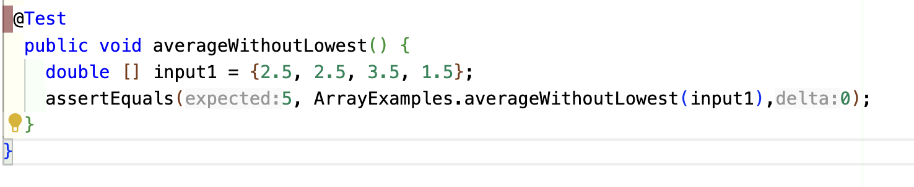
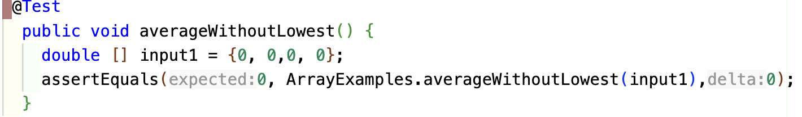
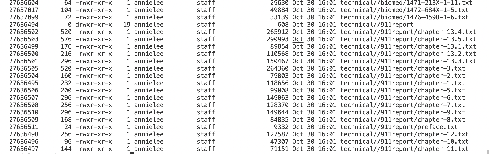
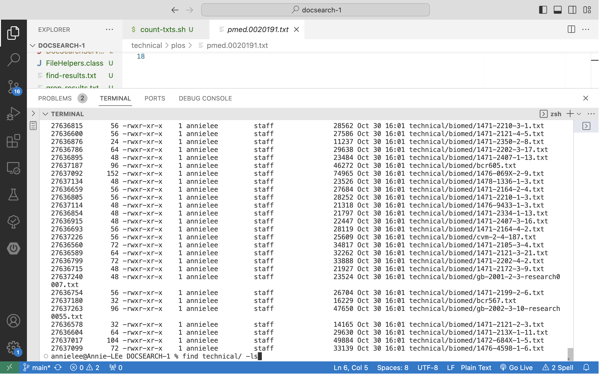
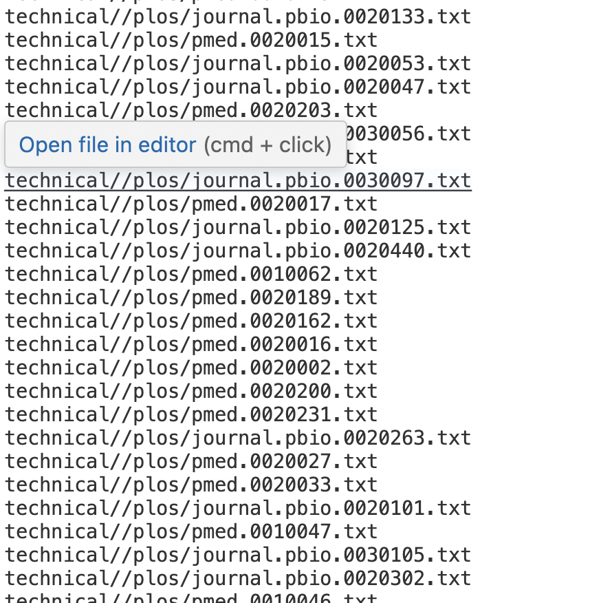
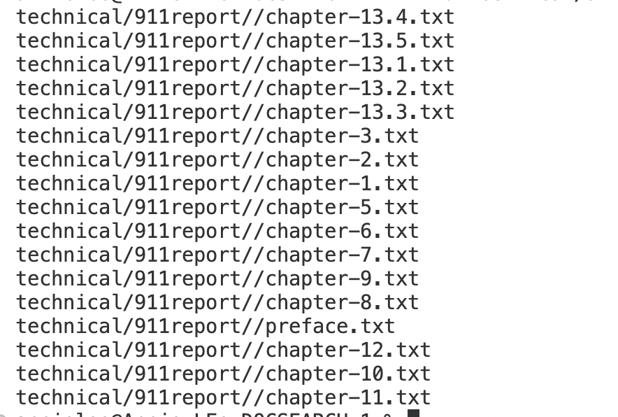
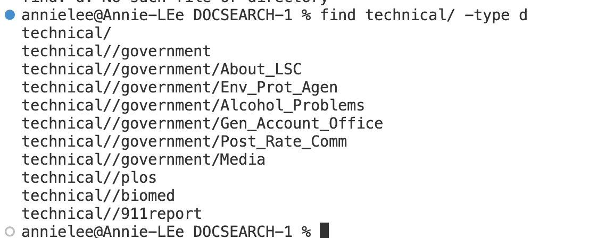
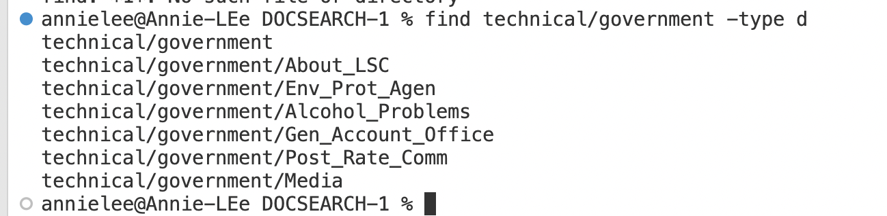
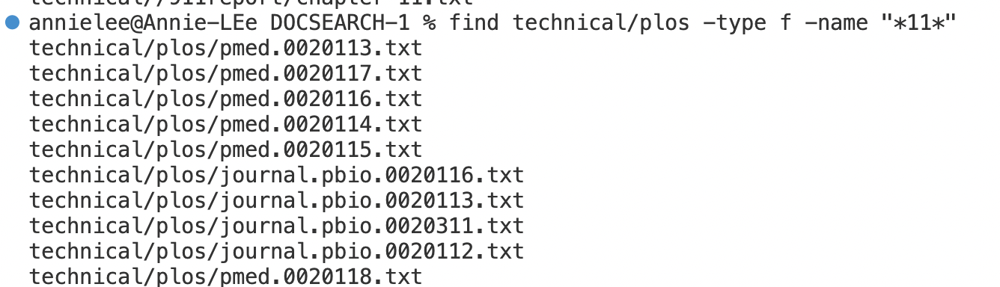

Part 1 - Bugs
1. A failure-inducing input for the buggy program,:
2. An input that doesn’t induce a failure:
3. The symptom, as the output of running the tests: 
4. The bug, as the before-and-after code change required to fix it:
5. buggy code:
6. fixed-code:
7. fixed-code-output:

   The code is now fixed because originally the function would return a double without rounding it off, so we cannot input an expected value under such a situation. After the fix, the function now rounds to 2 decimal places so we can input an expected value.
   
Part 2 -Researching Commands
Find commands
1. Find everything: find  directory/ -ls 
This command finds files and directories within the given directory and its subdirectories then lists them with information such as permissions, owner, size, modification date, and the file or directory name.

-Example 1. Find command within the technical directory: it finds and lists all the file and directory info within the given directory. In this case, it's all files within the technical directory. 
Command:
Output: 
- -Example 2. find command within the technical/biomed directory: it finds and lists all the file and directory info within the given directory. In this case, it's all files within the biomed directory that are inside the technical directory.
  Command:
  Output:

 2. Find files by file type: find directory/ -type f, f stands for file  -name "* filetype".
    This command finds only the files with the given file type in the given directory.
-Example 1. Find command looking for files within the technical directory that is ".txt" filetype: it finds and lists all the file info that is the given file type within the given directory. In this case, it's all files with file names that contain ".txt." within the technical directory. 
Command:
Output:

-Example 2. Find command looking for files within the technical/911report directory that is ".txt" filetype: it finds and lists all the file info that is the given file type within the given directory. In this case, it's all files with file names that contain ".txt." within the technical/911report directory.
Command:
Output:

3.  Find directories: find directory/ -type d, d stands for the directory. This command finds only the subdirectories within the given directory.
   Example 1. This command finds only the subdirectories within the technical directory.
Command and Output: 
  Example 2. This command finds only the subdirectories within the technical/government directory.
Command and Output: 

5. Find a single file by approximate name: find directory/ type f - name "*approx name*"
   This command finds files within the given directory with the approximate name input. 
   Example 1.
   This command finds files within the technical directory with the approximate file name "chapter-1".
   Command and Output:
   Example 2.
   This command finds files within the technical/plos directory with the approximate file name "11".
   Command and Output:
   
