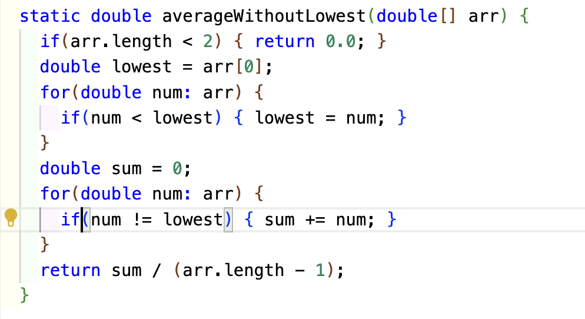

Part 1 - Bugs
1. A failure-inducing input for the buggy program,:
2. An input that doesn’t induce a failure:
3. The symptom, as the output of running the tests: 
4. The bug, as the before-and-after code change required to fix it:
5. buggy-code:
6. fixed-code:
7. fixed-code-output:
