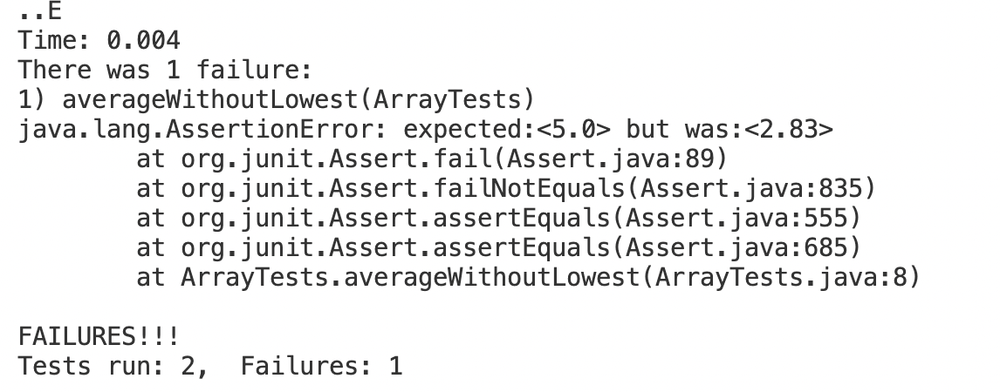

Part 1 - Bugs
1. A failure-inducing input for the buggy program,
   
   @Test
  public void averageWithoutLowest() {
    double [] input1 = {2.5,2.5,1.5,3.5};
    assertEquals(5, ArrayExamples.averageWithoutLowest(input1),0);
   }
2. An input that doesn’t induce a failure:
  @Test
  public void averageWithoutLowest2() {
    double [] input1 = {0, 0,0, 0};
    assertEquals(0, ArrayExamples.averageWithoutLowest(input1),0);
  }

3.  The symptom, as the output of running the tests: 

4. The bug, as the before-and-after code change required to fix it:
 buggy code:

static double averageWithoutLowest(double[] arr) {
    double total=0;
    if(arr.length < 2) { 
      return 0.0; }
    double lowest = arr[0];
    for(double num: arr) {
      if(num < lowest) { 
        lowest = num; }
    }
    double sum = 0;
    for(double num: arr) {
      if(num != lowest) { 
        sum += num; }
    }
    return sum/(arr.length-1);
  }
fixed-code:

  static double averageWithoutLowest(double[] arr) {
    double total=0;
    if(arr.length < 2) { 
      return 0.0; }
    double lowest = arr[0];
    for(double num: arr) {
      if(num < lowest) { 
        lowest = num; }
    }
    double sum = 0;
    for(double num: arr) {
      if(num != lowest) { 
        sum += num; }
    }
    
      total = sum / (arr.length-1);
      double roundOff = Math.round(total*100.0)/100.0;
    return (roundOff);
  }
5. fixed-code-output:
The code is now fixed because originally the function would return a double without rounding it off, so we cannot input an expected value under such a situation. After the fix, the function now rounds to 2 decimal places so we can input an expected value.
 

Part 2 -Researching Commands
Find commands
1. Find everything: find  directory/ -ls 
This command finds files and directories within the given directory and its subdirectories then lists them with information such as permissions, owner, size, modification date, and the file or directory name (skenlon, 2).

-Example 1. Find command within the technical directory: it finds and lists all the file and directory info within the given directory. In this case, it's all files within the technical directory. 

annielee@Annie-LEe docsearch-1 % find technical/ -ls
27636508      256 -rwxr-xr-x    1 annielee         staff              128370 Oct 30 16:01 technical//911report/chapter-7.txt
27636510      296 -rwxr-xr-x    1 annielee         staff              149644 Oct 30 16:01 technical//911report/chapter-9.txt
27636509      168 -rwxr-xr-x    1 annielee         staff               84835 Oct 30 16:01 technical//911report/chapter-8.txt
27636511       24 -rwxr-xr-x    1 annielee         staff                9332 Oct 30 16:01 technical//911report/preface.txt
27636498      256 -rwxr-xr-x    1 annielee         staff              127587 Oct 30 16:01 technical//911report/chapter-12.txt
27636496       96 -rwxr-xr-x    1 annielee         staff               47307 Oct 30 16:01 technical//911report/chapter-10.txt
27636497      144 -rwxr-xr-x    1 annielee         staff               71151 Oct 30 16:01 technical//911report/chapter-11.txt

- -Example 2. find command within the technical/biomed directory: it finds and lists all the file and directory info within the given directory. In this case, it's all files within the biomed directory that are inside the technical directory.
annielee@Annie-LEe docsearch-1 % find technical/biomed -ls
27636578       32 -rwxr-xr-x    1 annielee         staff               14165 Oct 30 16:01 technical/biomed/1471-2121-2-3.txt
27636604       64 -rwxr-xr-x    1 annielee         staff               29630 Oct 30 16:01 technical/biomed/1471-213X-1-11.txt
27637017      104 -rwxr-xr-x    1 annielee         staff               49884 Oct 30 16:01 technical/biomed/1472-684X-1-5.txt
27637099       72 -rwxr-xr-x    1 annielee         staff               33139 Oct 30 16:01 technical/biomed/1476-4598-1-6.txt

 2. Find files by file type: find directory/ -type f, f stands for file  -name "* filetype".
    This command finds only the files with the given file type in the given directory.
-Example 1. Find command looking for files within the technical directory that is ".txt" filetype: it finds and lists all the file info that is the given file type within the given directory. In this case, it's all files with file names that contain ".txt." within the technical directory. (skenlon, 5).
Command:
Output:

-Example 2. Find command looking for files within the technical/911report directory that is ".txt" filetype: it finds and lists all the file info that is the given file type within the given directory. In this case, it's all files with file names that contain ".txt." within the technical/911report directory.
Command:
Output:

3.  Find a single file by size: find . -size +/- (means less than or greater than) and give the size an integer + b, k, or m.
   This command gives the files that are less than or greater than(according to the command + or -) the size given.
   Example 1. This command finds the files that file sizes of less than 50 Kilobytes in the technical directory.

  annielee@Annie-LEe docsearch-1 % find technical/ . -size +50k
technical//government/About_LSC/Strategic_report.txt
technical//government/About_LSC/commission_report.txt
technical//government/About_LSC/State_Planning_Report.txt
technical//government/Env_Prot_Agen/multi102902.txt

 Example 2. This command finds files that file sizes of greater than 100 Kilobytes in the 911report directory.
 
annielee@Annie-LEe docsearch-1 % find technical/911report . -size +100k
./technical/government/Gen_Account_Office/d01376g.txt
./technical/government/Gen_Account_Office/Statements_Feb28-1997_volume.txt
./technical/government/Gen_Account_Office/pe1019.txt
./technical/government/Gen_Account_Office/gg96118.txt
./technical/government/Gen_Account_Office/d01591sp.txt
./technical/government/Gen_Account_Office/im814.txt
